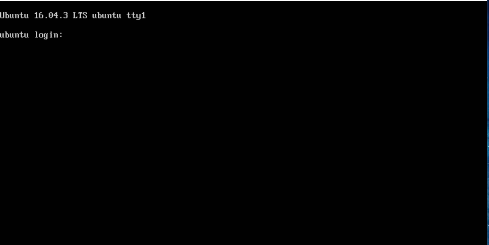
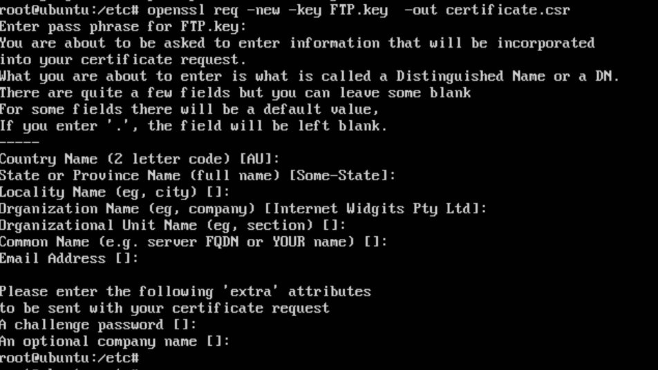
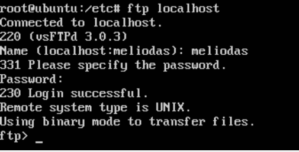

# VSFTP GUIDE

### Contact
- Twitter: @Dubliyu
- Slack: @yourlocalgod on wcscusf.slack.com
- Email: [Gmail](mailto:cleonromero@mgail.com)

### Table
1. [Prerequisites](#pre-reqs)
2. [Setup Ubuntu VM](#setup-vm)
3. [Install VSFTPD](#install)
4. [Secure VSFTPD](#secure)
5. [Users](#users)
6. [Testing](#testing)
7. [Wrote some useful Commands here](/../../knowledge/leon/ftp_shell.md)

<a id="pre-reqs"></a>
## Prerequisites 
1. Have your [virtual environment](https://silexone.github.io/guides/nestor/ISPsetup.html) configured
2. Have the [ISP](https://silexone.github.io/guides/nestor/ISPsetup.html) gateway running.
3. Have pfSense running.


## Summary 
This is the setup guide for a vsftp box. VSFTPD is an FTP server.
An FTP server makes some directory available so that people can connect to the server
and transfer files over the File Transfer Protocol i.e. FTP.
It common, it's tedious, and has been the source of many exploits over the years.
So we can expected in SECDC.

<br>

<a id="setup-vm"></a>
## Setup Ubuntu VM 
1. First, go get the Debian server from ISO [here](https://www.ubuntu.com/download/server/thank-you?version=16.04.3&architecture=amd64). 

    Then, open up VirtualBox, create a new Linux Ubuntu (64-bit) VM, the default setting will do. Then alter the network settings to use **Host-only** adapter instead of NAT. Insert the downloaded ISO into the virtual optical drive and boot.
   
2. Select default options during the installation. 
3. Now you should see a terminal login prompt. Login.


<br>

<a id="install"></a>
## Install vsftpd 
Here we will install and configure vsftpd. Some background knowledge, FTP servers can be either passive or active. If active, the client connects to a random port and port 21 serves as a control port - this creates some problems with firewalls btw. If passive, connect first to port 21 then when requesting a file the transfer will move onto a random port. Ours is passive by default.

1. Preparations

    First become superuser and fetch updates
    ``` bash
    sudo su
    apt-get update
    apt-get upgrade
    ```
2. Install vsftpd
    
    ``` bash
    apt-get install -y vsftpd
    ```
3. Enable the vsftpd service to run on boot.

    ```bash
    systemctl start vsftpd
    systemctl enable vsftpd
    ```
4. Verify that VSFTPD is listening on port 21
    
    Run `netstat -ant`
     ```bash
     tcp6   0    0   :::21         :::*         LISTEN
     ```
5. Now go test it out, [here](#test-unsecure)
<br>

<a id="secure"></a>
## Secure vsftpd
Here we will configure and secure our vsftpd server. Protip: on the ubuntu machine the conf files is in `/etc/vsftpd.conf` but in non-debian distros its generally inside `/etc/vsftpd/vsftpd.conf`.
 
1.  First generate some keys.
    This guy [here](https://youtu.be/GSIDS_lvRv4) give an awesome explanation. We will secure our FTP traffic in this way.
    
    ```bash
    openssl genrsa -des3 -out FTP.key
    # enter a passphrase
    Enter pass phrase fpr FTP.key: {enter a passphrase}
    ```
    You should see something like this
    
    
    Now make the cert request
    ```bash
    openssl req -new -key FTP.key -out certificate.csr
    ```
    You should see this
    
    
    Next, lets get rid of the pass phrase on the key
    ```bash
    cp FTP.key original.key
    openssl rsa -in original.key -out ftp.key
    ```
    
    Now make the actual certificate (all on one line)
    ```bash
    openssl x509 -req -days 365 -in certificate.csr -signkey ftp.key -out my_cert.crt
    ```
    You should see this
    
    ```
    # and lastly move them to a safe plave
    cp ftp.key /etc/ssl/private/
    cp my_cert /etc/ssl/certs/
    ```
2. Lets edit the config files

    Open up `vsftpd.conf` with `vi`
    ```bash
    # Change this line
    pam_service_name=ftp
    
    # Add the following lines at the bottom
    ssl_enable=YES
    ssl_tlsv1=YES
    ssl_sslv2=NO
    ssl_sslv3=NO
    rsa_cert_file=/etc/ssl/certs/my_cert.crt
    rsa_private_key_file=/etc/ssl/private/ftp.key
    ssl_ciphers=HIGH
    ```
    
    Now save and restart the service
    ```bash
    systemctl restart vsftpd
    ```
    
3. Now go test it out, [here](#test-secure)
<br>

<a id="users"></a>
## Users
How to add users to vsftpd you ask? This is how.

1. Create a new user

    ```bash
    useradd -m jeff
    passwd jeff
    ```
Thats it theres no step 2, once they are users on the system you can connect with FTP using their credentials as shown in the testing section below.
    
<br>
    
<a id="testing"></a>
## Testing 
Lets make sure everything works

<a id="test-unsecure"></a>
1. Test localhost - insecure

    ```bash
    # install FTP package - our iso has it pre-installed
    apt-get install ftp
    # now try to connect
    ftp localhost
    # Enter your user name
    Name (localhost:{user-name}): {username}
    # Enter password
    Password: {secret-password}
    ```
    
    You should now see something like so
    
    
<a id="test-secure"></a>

2. Test localhost - securely

    First try to login using the process in step 1. You should get an error like so
    
    
    Next lets try to login securely
    ```bash
    # First install lftp
    apt-get install lftp
    # run these commands
    lftp
    lftp:~> set ssl:verify-certificate no
    lftp:~> connect localhost
    lftp user@localhost:~> login {user}
    Password: {password}
    # Now lets move arround to see that it works
    lftp user@localhost:~> cd /
    cd ok, cwd=/
    lftp user@localhost:~> ls
    bin
    root
    ...
    ```
    Like so...
    
<br>
    
<small>Photo by [Ricardo Gomez Angel](https://unsplash.com/@ripato?utm_source=ghost&utm_medium=referral&utm_campaign=api-credit) / [Unsplash](https://unsplash.com/?utm_source=ghost&utm_medium=referral&utm_campaign=api-credit)</small>